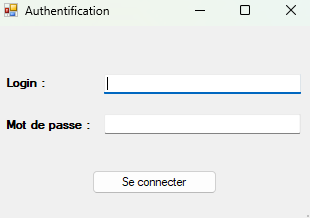
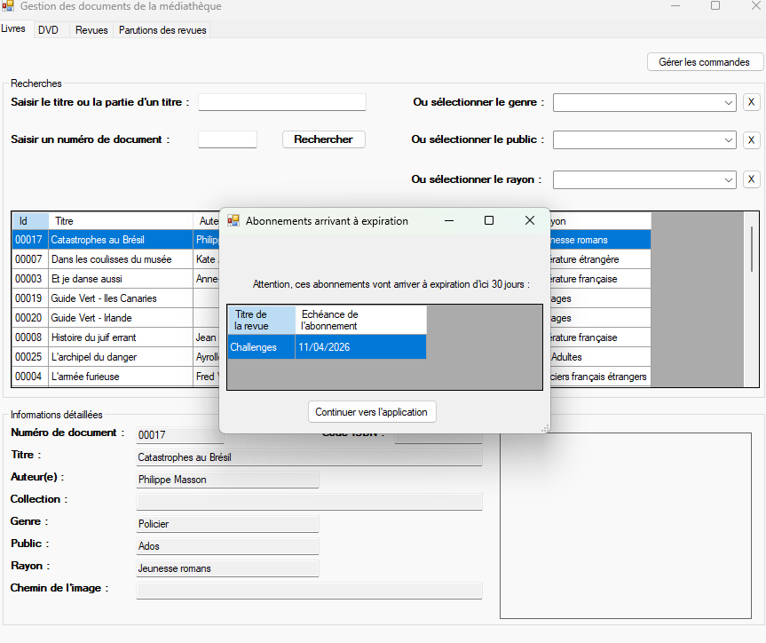
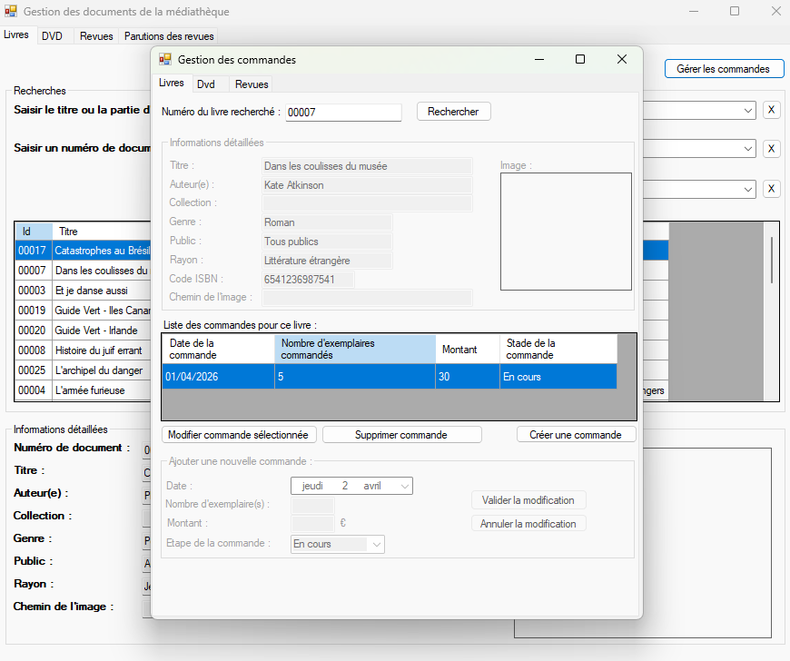
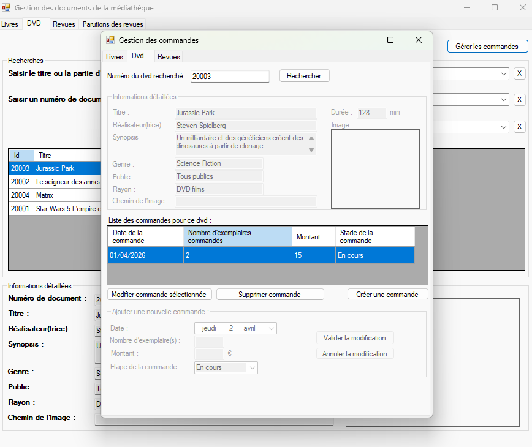
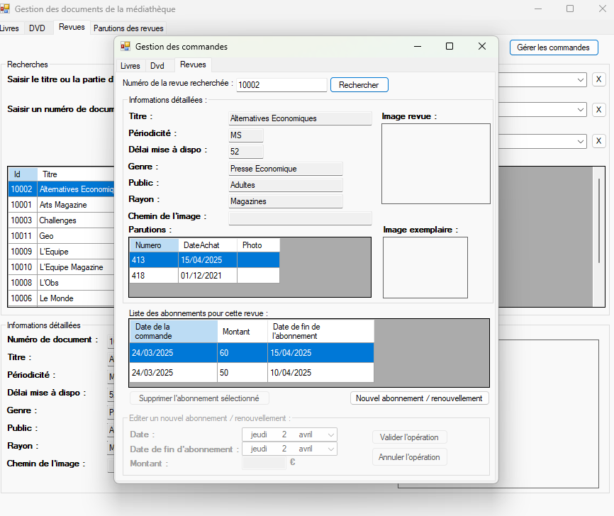

# MediatekDocuments
Cette application permet de gérer les documents (livres, DVD, revues) d'une médiathèque. Elle a été codée en C# sous Visual Studio 2019. C'est une application de bureau, prévue d'être installée sur plusieurs postes accédant à la même base de données. 
L'application exploite une API REST pour accéder à la BDD MySQL. Des explications sont données plus loin, ainsi que le lien de récupération.
Ce document apporte des explications sur les nouveautés de l'application déjà existante ici : https://github.com/CNED-SLAM/MediaTekDocuments

## Système d'Authentification
L'accès aux ressources est protégé par un module de connexion. Les privilèges sont attribués selon le service de l'utilisateur :

* **Service Administratif** : Accès complet (Catalogue + Commandes + Alertes).
* **Service Prêts** : Consultation du catalogue uniquement.
* **Service Culture** : Accès restreint (connexion refusée).

##  Alertes Abonnements

Lors de la connexion, si l'utilisateur appartient au service administratif, une fenêtre d'alerte s'affiche automatiquement pour lister les abonnements aux revues arrivant à expiration (sous 30 jours). Cela permet une gestion proactive des renouvellements avant d'accéder au catalogue principal.

##  Pilotage des Commandes

### Accès au module
Chaque fiche du catalogue dispose d'un bouton **"Gérer les commandes"**. L'application vous oriente automatiquement vers l'onglet correspondant au type de document sélectionné (Livres, DVD ou Revues).

L'interface de commande se décompose en quatre zones :
1. **Recherche** : Identification du document par son numéro.
2. **Détails** : Affichage des informations complètes du document.
3. **Historique** : Liste des commandes déjà passées.
4. **Édition** : Zone de création ou de modification d'une commande.

## Gestion des Revues (Abonnements)

Le module "Revues" permet de piloter les abonnements annuels :
* **Suivi des parutions** : Recherche par numéro de revue pour afficher les exemplaires reçus.
* **Nouvel abonnement** : Création avec contrôle de cohérence (la date de début doit être inférieure à la date de fin).
* **Sécurité de suppression** : Un abonnement ne peut être supprimé si des exemplaires de revues y sont déjà rattachés.

## Installation

L'application C# peut être installée via le dossier MediaTekDocumentsSetup.

